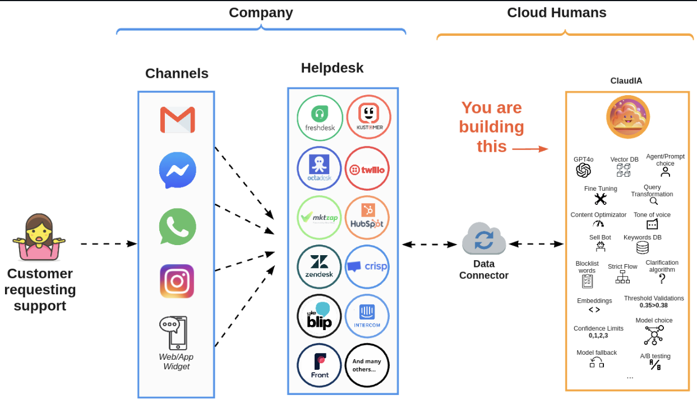

# cloudhumans.take-home
This is the implementation of Cloud Humans Take-Home assignment.

> View the challenge description on the [oficial repo](https://github.com/cloudhumans/take-home) or view our copy [here](./docs/OriginalChallengeSpecifications.md).

## Running the application

The easyest way to run the aplication is using [Docker](https://www.docker.com/) or [Podman](https://podman.io/) as container solutions.

1. With Docker use the following commands:

    ```shell
    # Start the application
    docker compose up -d

    # Stop the execution started with the previous command
    docker compose down
    ```

    >💡Tip: Instead of Docker you could also use **dotnet CLI** or IDEs like **Visual Studio** or **JetBrains Rider** in order to run the application.

2. Once the application is running, you can access via `http://localhost:8080/`. To see the OpenApi documentation access `http://localhost:8080/swagger`.

3. Here is the cURL to call the API:
    ```shell
    curl --location 'http://localhost:8080/conversations/completions' \
    --header 'Content-Type: application/json' \
    --data '{
        "helpdeskId": 123456,
        "projectName": "tesla_motors",
        "messages": [
            {
                "role": "USER",
                "content": "Hello! How long does a Tesla battery last before it needs to be replaced?"
            }
        ]
    }'
    ```

## Main Technical Decisions



Given the high level image above, provided for the challenge, we could assume that ClaudIA is a complex ecosystem with different "modules" colaborating to achieve the business goals.

Based on that we made some technical decisions:

1. We adopted the `Vertical Slice Architecture` and separated the WebApi deployment from the Core/Domain project, preparing the structure to receive the next related modules, when implemented.
1. Adopted `Command Query Separation (AKA: CQS)` in order to clarify each feature behaviour and avoid un-intentional side efects like mutation from a feature that should only "query" data.
1. We also adopted some functional behaviours in order to improve the application consistency, like `Result Pattern` found as the Result wrapper used in most of the operation returns and commands.
1. For the API itself we decided to use the REPR pattern via FastEndpoints in order to specify only one endpoint per file, avoiding the couppling.
1. Last but least, we designed our application thinking about DDD (Domain Driven Design), considering the Conversation as an aggregate root.

Next steps:

1. Based on the request sample provided on the challenge description, that has `helpdeskId` and `projectName`, we can assume that our solution is multi tenant. Also we should validate the informed data on domain, possibly aggregate more info from the specific database. So in our current structure we would add a `ConversationsRepository` (Using the Repository pattern) as our data access for the Conversation aggregate.

### 📌 These are the main decisions, feel free to agree or disagree with them, I would love to chat about it. 😊

## References

- [OpenAI API Documentation](https://platform.openai.com/docs/guides/text-generation#quickstart)
- Fun fact, we used [Gitmoji](https://gitmoji.dev/) as a prefix on the commit messages since it enhances the commit's understanding
